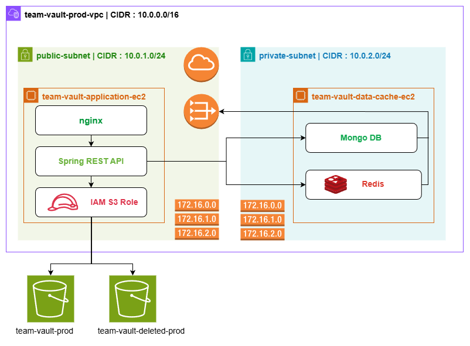

# 🚀 Team Vault

**Team Vault** is a **production-grade, secure file-sharing platform** designed for teams to collaborate on documents, files, and resources with **granular access control**, **role-based permissions**, and **comprehensive audit logging**.

Built with **Spring Boot 3, MongoDB, AWS S3, and an event-driven architecture**, it demonstrates **enterprise-level software engineering patterns** and **cloud infrastructure design**.

---

## 🏗️ Team Vault — Cloud Architecture & Deployment Overview

  

  <em>Secure AWS VPC deployment with public/private subnets, NAT gateway, IAM-based S3 access, and isolated data services</em>

---

## ✨ Key Highlights

* 🔐 **JWT-Based Authentication**
  Stateless security with token-based authentication and role claims.

* 👥 **Role-Based Access Control (RBAC)**
  3-tier hierarchy: `USER → ADMIN → SUPER_ADMIN` with strict permission enforcement.

* 📁 **Secure File Storage (AWS S3)**
  Supports **multipart uploads** for large files with controlled access and validation.

* 🔗 **Group Management & Membership System**
  Invitation-based group membership with permission hierarchies and lifecycle states.

* 📊 **Event-Driven Architecture**
  Centralized **audit logging** and system events for traceability and compliance.

* ⚡ **Redis Caching**
  Performance optimization for frequently accessed data and authorization checks.

* 🏗️ **AWS VPC Deployment**
  Secure public/private subnet architecture with NAT-based outbound access.

* 🧪 **Comprehensive Test Coverage**
  Unit and integration tests for authentication, RBAC, group flows, and system events.

---

## 🏛️ Architecture Overview

### High-Level Design

Team Vault follows a **layered, cloud-native architecture** with strict separation of concerns:

* **REST API Layer** — Handles client communication and request validation
* **Service Layer** — Implements business logic and domain rules
* **Security Layer** — Enforces JWT authentication, RBAC, ACLs, and method-level authorization
* **Repository Layer** — Manages MongoDB queries, aggregations, and caching strategies
* **Infrastructure Layer** — Integrates AWS S3, Redis, and cloud security services

---

## 🧩 Component Architecture

### REST API Layer

* AuthController
* GroupController
* ResourceController
* ResourceEngagementController

### Service Layer

* AuthService
* UserService
* GroupService
* GroupMemberService
* ResourceService
* ResourceEngagementService

### Security & Authorization Layer

* JWT Authentication Filter
* RBAC Enforcement
* Custom Security Annotations
* ACL & Permission Validators
* Method-Level Security (`@PreAuthorize`, `@PostAuthorize`)

### Query & Repository Layer

* Query Processors (with Redis caching)
* MongoDB Repositories
* Aggregation Pipelines for reporting and analytics

### Data & Infrastructure Layer

* MongoDB (Persistence)
* Redis (Caching & Performance)
* AWS S3 (File Storage via IAM Roles)

---

## 🧰 Technology Stack

| Layer                | Technology                       | Purpose                        |
| -------------------- | -------------------------------- | ------------------------------ |
| Language & Framework | Java 17, Spring Boot 3.x         | Backend runtime & framework    |
| Security             | Spring Security, JWT, BCrypt     | Authentication & authorization |
| Database             | MongoDB 5.0+                     | NoSQL data persistence         |
| Caching              | Redis                            | Performance optimization       |
| Cloud Storage        | AWS S3                           | Secure file storage            |
| Cloud Security       | AWS IAM Roles                    | Credential management          |
| Deployment           | AWS EC2, VPC                     | Infrastructure & networking    |
| Messaging            | Spring ApplicationEventPublisher | Event-driven architecture      |
| Build Tool           | Maven                            | Dependency & build management  |
| Testing              | JUnit 5, Mockito                 | Unit & integration testing     |

---

## 🔐 Permission Model

* Users have **application-level roles**
* Users have **group-level permissions**
* Custom annotations enforce **both role and permission checks**
* Uses Spring method security with `@PreAuthorize` and `@PostAuthorize`

### Group Member Permissions

* `READ_RESOURCE` → View resources
* `WRITE_RESOURCE` → Upload/modify resources
* `MANAGE_USER_ROLES` → Update member permissions
* `REMOVE_USER` → Remove members from group
* `INVITE_USER` → Invite new members

---

## 🔒 Data Security

* **Password Encryption** — BCrypt (strength 12)
* **In-Transit Security** — HTTPS/TLS via NGINX reverse proxy
* **At-Rest Security** — AWS S3 server-side encryption (configurable)
* **Credentials** — IAM Roles (no hardcoded secrets)
* **Input Validation** — DTO-level validation annotations
* **Output Sanitization** — Sensitive fields excluded from responses

---

## 📊 Key Features

### 1. User Management

* User registration with email/phone validation
* Role hierarchy: `USER → ADMIN → SUPER_ADMIN`
* Self-profile management
* Role promotion/demotion with audit logging
* Soft delete with status flag

### 2. Group Management

* Create groups with strict admin assignment rules
* Group visibility: `PUBLIC` / `PRIVATE`
* Group statistics (members, admins, pending requests)
* Soft delete with cascading member updates
* Group access metadata tracking

### 3. Group Membership

* Time-bound invitations
* Accept/reject flows
* Exit group support
* Granular per-member permissions
* Event-driven membership logging

### 4. File Management

* **Direct Upload** — ≤ 10MB (streamed to S3)
* **Multipart Upload** — > 10MB (chunked with progress tracking)
* File versioning via S3
* Soft delete with scheduled cleanup
* File tagging: `SMALL / MEDIUM / LARGE`
* Presigned URLs with configurable expiry (default: 15 min)
* Compliance-friendly deletion bucket

### 5. Resource Engagement

* Likes/Dislikes (mutually exclusive)
* Ratings (1–5 scale with 0.5 increments)
* Comment history with edit/delete tracking
* WRITE permission required to engage

### 6. Audit & Logging

* Event-driven action tracking
* **GroupMemberLog** — Invitations, accept/reject, exits, permission changes
* **UserRoleChangeLog** — Promotions/demotions
* Automatic timestamps
* Non-repudiation (all actions tied to user identity)

---

## 🧪 Testing Strategy

* **Unit Tests** — Services, security rules, and permission validators
* **Integration Tests** — API endpoints, MongoDB, Redis, and event publishing
* **Security Tests** — JWT validation, role enforcement, and permission boundaries
* **Failure Scenarios** — Invalid tokens, unauthorized access, and data integrity checks

---

## 🌟 Why This Project Stands Out

* Enterprise-grade **security-first design**
* Cloud-native **AWS infrastructure**
* Strong **domain-driven and event-driven architecture**
* Production-ready **audit logging & compliance features**
* Designed for **scalability, performance, and maintainability**

---
